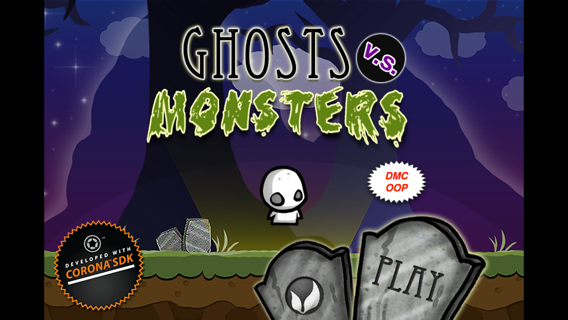
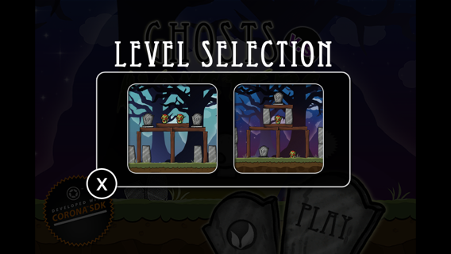
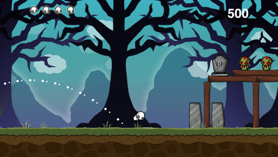

# Ghost vs Monsters OOP 2.0

The complete game *Ghosts vs. Monsters*, rewritten in an object-oriented style: an example of how to split a Solar2D (formerly Corona SDK) app into objects that each do one job.

The original was a physics-based game template for mobile devices, made by Jonathan and Biffy Beebe (Beebe Games) for Corona SDK and published by Ansca (later Corona Labs) in 2010: you fling a ghost at a structure to knock out the monsters on it. Many thanks to everyone at Beebe Games and Corona Labs for making the code public. The original repository is gone; [n8fr8/Ghosts-vs.-Monsters](https://github.com/n8fr8/Ghosts-vs.-Monsters) is a 2011 copy, and the [announcement](https://web.archive.org/web/2011/http://blog.anscamobile.com/2010/12/ghosts-vs-monsters-open-source-game-in-corona-sdk/) is in the Internet Archive.

| menu | level selection | a shot in flight |
|---|---|---|
|  |  |  |

## Quick Start

The following gets you playing in about five minutes in the Solar2D Simulator on macOS or Windows. It runs the game from this repository as it is.

1. Clone the repository: `git clone https://github.com/dmccuskey/Ghost-vs-Monsters---OOP.git`
2. In the Solar2D Simulator, open its `main.lua` (File > Open). The menu appears.
3. Click the **Play** tombstone, then a level.
4. Drag back from the ghost and let go: it flies the opposite way, harder the farther you drag. Knock out the monsters with the four ghosts you have. Swipe sideways before a shot to look at the level.

## What Changed From the Original

The rewrite follows one principle from *Head First Design Patterns*: "Identify the aspects of your application that vary and separate them from what stays the same." Change is constant (characters, levels, platforms), and objects that each hide one part of the game limit what a change can break. Some changes are plain, like moving the ghost into its own class; others prepare for changes that might come, like loading levels as JSON from a web service, or keeping the game engine separate enough to reuse for another "Angry Birds"-type game.

The game itself is meant to stay the same: from the player's side, nothing should look different, except a few additions such as a progress bar on the loading screen. Much of the original code and many of its variable names remain, so the two code bases are easy to compare.

Version 2.0 (2015) brought it up to date with Corona's Graphics 2.0, replaced the Director library with Composer, the UI library with buttons from [DMC-Corona-UI](https://github.com/dmccuskey/DMC-Corona-UI) (then DMC-Corona-Widgets), and moved the components into their own files and folders.

## Project Layout

| file | what it does |
|---|---|
| `main.lua` | Starts the app controller (or the test controller) and sets the two switches below. |
| `app_controller.lua` | Sets up the app (display groups, managers) and moves between the scenes. |
| `scene/menu_scene.lua`, `scene/menu/` | The menu: its view and the level selection overlay. |
| `scene/game_scene.lua`, `scene/game/` | Game play: `game_view.lua` is the game engine (the camera, aiming, the rounds); `gameover_overlay.lua` shows the result. |
| `component/object_factory.lua` | Creates any game object by name, from one line: `ObjectFactory.create( 'ghost' )`. This is what keeps the level data simple. |
| `component/object_factory/` | The three objects with behavior: `cloud.lua` (drifts, pauses with the game), `monster.lua` (its images, collisions, the points a hit is worth) and `ghost.lua`. |
| `component/load_overlay.lua`, `pause_overlay.lua` | The loading screen, with a progress bar that can stay up across a scene change, and the pause screen. |
| `service/level_manager.lua` | Knows the levels and which one comes next; the place for locked levels or levels from the Internet. |
| `data/levels.lua` | The level data, in plain tables that map directly to JSON. |
| `service/sound_manager.lua` | Loads and plays the sounds. |
| `service/megaphone.lua` | Global messages between components, used when `GLOBAL_COMMS` is on. |
| `test_controller.lua` | Runs one component on its own, for development. |
| `lib/`, `dmc_corona_boot.lua`, `dmc_corona.cfg` | The DMC libraries the app uses (2015 copies), and their loader and settings ([dmc-corona-boot](https://github.com/dmccuskey/dmc-corona-boot)). |

The ghost is the most involved object. A state machine (dmc-objects' States mixin) runs it through its life: Conceived, Born, Living, Aiming, Flying, Hit, Dying and Dead. It brings itself onto the stage, hovers until launched, then handles its blast, collisions and images, which makes its behavior easy to follow and to change. The game view is a state machine too: a new round, aiming, a shot in play, the end of a round, the end of the game.

### Switches in `main.lua`

| switch | values | effect |
|---|---|---|
| `GLOBAL_COMMS` | `false` (default), `true` | How components talk: directly to each other, or through global messages (dmc-megaphone). |
| `gMODE` | `'RUN'` (default), `'TEST'` | `'TEST'` starts `test_controller.lua`, which shows one component on its own: uncomment the one you want in `TestController.runTests()` (the loading screen by default). |

## Known Issues

- The libraries in `lib/` are 2015 copies of the DMC libraries; the loader was updated in 2026 so the game runs on current Solar2D.
- The OpenFeint settings in `main.lua` are left from the original; OpenFeint shut down in 2012.
- In 2015 the physics world sometimes glitched at the start of a level, then settled; the original had the same problem.

## License

The code is MIT licensed (see the header of each file); the original game's parts are Copyright (C) 2010 Ansca Inc.
